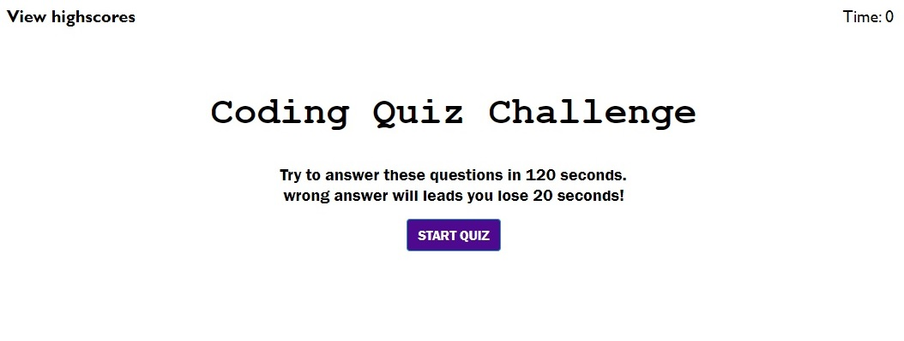
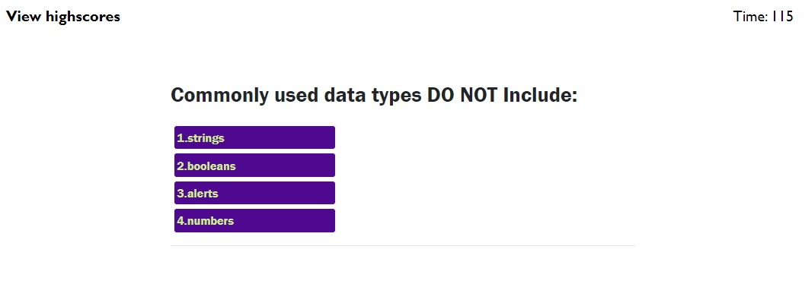

# 04-Web-APIs
This is a quiz application using HTML, CSS, Bootsrap and Javascript.That builds a timed code quiz with multiple-choice questions. 
This app will run in the browser and feature dynamically updated HTML and CSS powered by your JavaScript code. 
It will also feature a clean and polished user interface and be responsive, ensuring that it adapts to multiple screen sizes.

<b>Screenshots</b>

<i>Start page/landing page: </i>

<i>Quiz in progress: </i>

<i>All Done: </i>

<i>HighScores: </i>

<i> 
<a href="https://beshayr2020.github.io/04-Web-APIs/">Quiz Application</a>
</i>